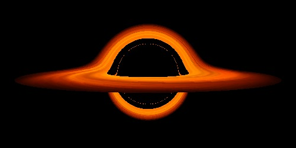

# Curved Spacetime Raytracer
This project is based on my previous raytracer and extended to a curved spacetime by using an approximation of the Schwarzschild metric, which is a solution for Einstein's field equations that describes gravity in the vicinity of a radially simmetrical distribution of matter, without rotation or charge.

## References

* https://github.com/jrmiranda/raytracer
* https://dmitrybrant.com/2018/12/11/ray-tracing-black-holes
* http://rantonels.github.io/starless/
* https://locklessinc.com/articles/raytracing/